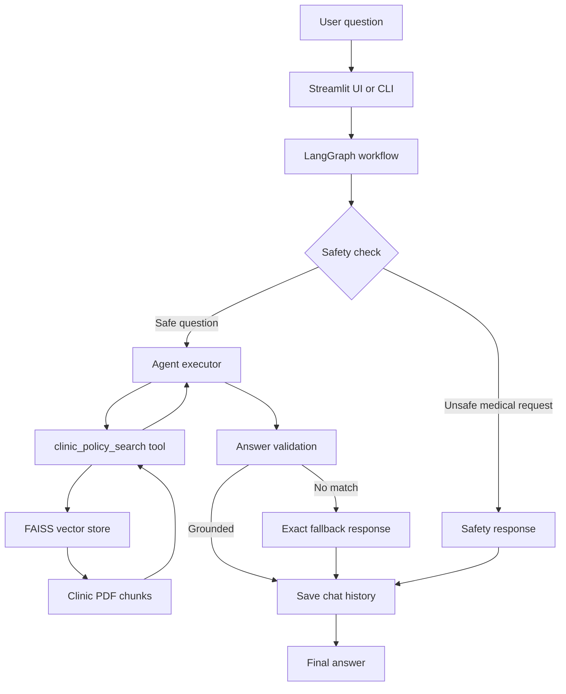

# Healthcare Clinic RAG Assistant

> A professional, document-grounded healthcare clinic assistant built with LangGraph, LangChain, FAISS, and Streamlit.

This project answers clinic questions only from the PDF documents stored in `docs/`. It is designed for appointment help, lab instructions, clinic timings, fees, report collection, medicine refill policy, and emergency guidance. The assistant is intentionally constrained to the clinic knowledge base so responses stay grounded and predictable.

## Topics

`streamlit` `langchain` `langgraph` `rag` `faiss` `pdf` `healthcare` `assistant` `python` `ai`

## Contents

- [Overview](#overview)
- [Key Features](#key-features)
- [UI Preview](#ui-preview)
- [Architecture](#architecture)
- [Project Layout](#project-layout)
- [Setup](#setup)
- [Configuration](#configuration)
- [Build and Run](#build-and-run)
- [Testing](#testing)
- [Data Sources](#data-sources)
- [Safety and Fallback Rules](#safety-and-fallback-rules)
- [License](#license)

## Overview

The assistant follows a retrieval-augmented generation pipeline:

1. A user asks a question.
2. LangGraph routes the request through safety checks and the agent.
3. The agent uses the `clinic_policy_search` tool to retrieve relevant document chunks from FAISS.
4. The final response is grounded in the clinic PDFs and stored in local chat history.

The project includes both a CLI workflow and a Streamlit web UI.

## Key Features

- PDF-only knowledge base for grounded answers.
- LangGraph orchestration with memory/checkpointing.
- Tool-calling agent using `clinic_policy_search`.
- Local FAISS vector store with Hugging Face embeddings.
- Safety routing for unsafe medical diagnosis or treatment questions.
- Session-aware chat history stored locally in JSONL.
- Streamlit interface with a polished dashboard-style layout.
- Groq or Gemini model support through environment configuration.

## UI Preview

The current Streamlit interface is intentionally designed as a clean, clinical dashboard rather than a plain chat page. The attached screenshots show the active visual direction used in this repo:

- A full-width gradient hero with clinic branding.
- Short, readable chips for core capabilities.
- Prominent suggested prompt cards for common patient questions.
- A session card with the current thread ID and a clear-chat action.
- A large, single-line chat input anchored below the helper panels.
- Conversation bubbles with readable spacing and source-friendly answer formatting.

This layout is implemented in `streamlit_app.py` and styled through `.streamlit/config.toml` plus custom page CSS.

## Architecture



## Project Layout

```text
healthcare_clinic_assistant/
├── app.py                  # CLI entry point and assistant runner
├── streamlit_app.py        # Streamlit web UI
├── requirements.txt        # Python dependencies
├── README.md               # Project documentation
├── LICENSE                 # MIT license
├── docs/                   # PDF sources and source references
├── scripts/                # Data download utilities
├── src/                    # Agent, graph, tools, memory, safety, vector store
├── tests/                  # Manual test runner
├── chat_history/           # JSONL conversation logs
├── screenshots/            # UI assets and screenshots
└── vectorstore/            # Local FAISS index
```

## Setup

### 1. Create a virtual environment

Windows PowerShell:

```bash
python -m venv .venv
.\.venv\Scripts\activate
```

macOS/Linux:

```bash
python -m venv .venv
source .venv/bin/activate
```

### 2. Install dependencies

```bash
pip install -r requirements.txt
```

### 3. Create environment variables

Copy the example file:

```bash
copy .env.example .env
```

Then set one model provider.

#### Groq

```env
MODEL_PROVIDER=groq
GROQ_API_KEY=your_groq_api_key_here
GROQ_MODEL=llama-3.3-70b-versatile
```

#### Gemini

```env
MODEL_PROVIDER=gemini
GOOGLE_API_KEY=your_gemini_api_key_here
GEMINI_MODEL=gemini-2.5-flash
```

## Configuration

Additional optional settings are read from environment variables in `src/config.py`:

- `DOCS_DIR` for the PDF source folder.
- `VECTORSTORE_DIR` for the FAISS index location.
- `EMBEDDING_MODEL` for the embedding model.
- `TOP_K` for retrieval depth.
- `CHAT_HISTORY_PATH` for the JSONL conversation log.

## Build and Run

### Download the public PDFs

```bash
python scripts/download_public_pdfs.py
```

The source URLs are documented in [`docs/SOURCES.md`](docs/SOURCES.md).

### Build the vector index

```bash
python app.py --build-index
```

### Ask one question from the CLI

```bash
python app.py --question "How can I book an appointment?"
```

### Start the interactive CLI

```bash
python app.py
```

### Run the Streamlit UI

```bash
streamlit run streamlit_app.py
```

## Testing

Run the manual test suite:

```bash
python app.py --run-tests
```

Or execute the standalone test runner:

```bash
python tests/test_questions.py
```

The test set covers:

- appointment booking
- arrival timing
- fasting guidance
- water allowance while fasting
- emergency handling
- memory-based follow-up behavior
- fallback behavior for unsupported topics
- unsafe medical advice blocking

## Data Sources

The assistant uses public PDF documents downloaded into `docs/`. Their source list is maintained in [`docs/SOURCES.md`](docs/SOURCES.md).

The documents are used strictly as retrieval sources. If the relevant answer cannot be found, the assistant returns the exact fallback response defined in `src/config.py`.

## Safety and Fallback Rules

The system is intentionally conservative.

- Unsafe medical diagnosis or treatment questions are routed to a safety response.
- If retrieval fails to find relevant context, the assistant returns the exact fallback text:

```text
I could not find this information in the provided clinic documents. Please contact the clinic staff for confirmation.
```

- Answers should remain grounded in the clinic PDF corpus instead of general medical advice.

## License

This project is licensed under the MIT License. See [LICENSE](LICENSE) for details.

## Suggested GitHub Topics

If you want to mirror the README metadata in GitHub, these topics fit the project well:

- `streamlit`
- `langchain`
- `langgraph`
- `rag`
- `faiss`
- `python`
- `healthcare`
- `assistant`
- `pdf`
- `llm`